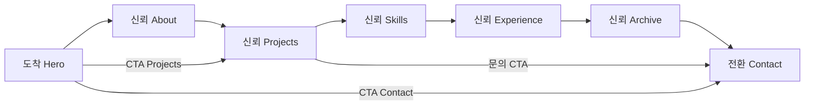

# IA & Wireframe — Jinkyung Kim Portfolio

> **문서 목적:** `docs/content.md` 콘텐츠 인벤토리를 기반으로 1인 제작 포트폴리오(싱글 페이지 + 앵커 내비)의 정보 구조와 반응형 와이어프레임을 정의한다.  
> **사이트 유형:** 개인 브랜딩 · 프로젝트 아카이브 · 협업/네트워킹 전환  
> **기본 가정:** 한/영 토글 또는 병기 UI, 프로젝트 상세는 동일 페이지 내 확장(아코디언/모달) — 별도 URL은 v2 옵션

---

## 1. 사이트맵 (페이지·섹션 위계)

싱글 페이지가 기본이며, 글로벌 크롬과 7개 앵커 섹션으로 구성한다. `content.md` §17 내비게이션 순서를 따른다.

```text
Portfolio (Single Page)
│
├── [Global] Site Chrome
│   ├── Header — 로고(이름), 앵커 Nav, 언어 토글(KR/EN), 모바일 메뉴
│   └── Footer — 브랜드 문장, ©, 보조 링크(선택: Archive 앵커)
│
├── #home — Hero (내비 라벨: Home)
│
├── #about — About
│   ├── Profile (사진 + 소개)
│   ├── Strengths (핵심 강점 3)
│   ├── Research Interests (관심분야 4)
│   └── Education (학력 타임라인)
│
├── #projects — Selected Projects
│   ├── Project List (카드 × 4)
│   └── Project Detail (인라인 확장 / 모달) [v1: 동일 페이지]
│       ├── C-PROJ-001 … C-PROJ-004
│
├── #skills — Skills
│   └── Skill Groups (Design · Viz · Research · BIM)
│
├── #experience — Experience & Proof
│   ├── Work Experience
│   ├── Research Experience
│   ├── Awards
│   └── Courses & Certifications
│
├── #archive — Archive
│   └── Timeline / List (학회·워크숍·교환·봉사 등)
│
└── #contact — Contact
    ├── Contact Copy
    └── Channels (Email 공개 · SNS 준비 중)
```

**v2 확장(선택, IA 예약)**

```text
/projects/[slug]  — 프로젝트 상세 독립 페이지 (SEO·공유용)
```

---

## 2. 섹션 스크롤 순서 · 목적 · 사용자 가치

| 순서 | 섹션 ID | 내비 라벨 | 섹션 목적 (디자이너 의도) | 사용자가 얻는 것 |
|:---:|:---|:---|:---|:---|
| 0 | — | — | **글로벌:** 어디서든 섹션 이동·언어 전환 | 길 잃지 않고 원하는 정보로 바로 이동 |
| 1 | `#home` | Home | **도착:** 정체성·키워드·첫인상 확립 | "누구인지, 무엇을 하는지" 5초 안에 파악 |
| 2 | `#about` | About | **신뢰 1:** 배경·관점·연구 방향 제시 | 실무↔연구 연결 스토리, 협업 적합성 판단 |
| 3 | `#projects` | Projects | **신뢰 2:** 대표 산출물·문제해결 구조 증명 | 포트폴리오 깊이, 역할·성과·도구 확인 |
| 4 | `#skills` | Skills | **신뢰 3:** 실행 역량(툴·방법) 가시화 | 프로젝트에 필요한 스킬 매칭 |
| 5 | `#experience` | Experience | **신뢰 4:** 경력·수상·교육으로 검증 | 기간·기관·성과의 객관적 근거 |
| 6 | `#archive` | Archive | **신뢰 5:** 사고의 확장·지속 학습 기록 | 공모·학회·교환 등 맥락 있는 이력 |
| 7 | `#contact` | Contact | **전환:** 협업·문의 장벽 최소화 | 이메일 한 번으로 연락 경로 확보 |

**스크롤 원칙:** Hero → 신뢰 축적(About → Projects → Skills → Experience → Archive) → Contact.  
Projects가 핵심 CTA(`Projects`)의 착지점이므로 About 직후에 배치해 **“정체성 → 증거”** 흐름을 유지한다.

---

## 3. 섹션별 콘텐츠 ID 매핑

### 3.1 글로벌 (Header / Footer)

| UI 블록 | 콘텐츠 ID | 비고 |
|:---|:---|:---|
| 사이트 타이틀 / 로고 | (기본정보) Name, One-line Identity | C-CON-001과 동일 인물 |
| 내비 라벨 | §17 Navigation | Home … Contact |
| Footer 카피 | §19 Footer, §6 Brand | Core Message KR/EN |
| 언어 | C-OPT-002 | Korean, English |

### 3.2 `#home` — Hero

| UI 블록 | 콘텐츠 ID |
|:---|:---|
| Display 타이틀 (한 줄) | One-line Identity → `도시를 읽는 설계자` / EN |
| 서브 카피 | §4 Supporting Copy KR/EN |
| 보조 키워드 태그 | §1 Keywords, C-OPT-006 (Interests 요약) |
| §6 Core Message | **v1 Hero 미노출** — Footer·메타·PRD §1.3 인용 (`content.md` §6, `prd.md` FR-11a) |
| CTA Primary | §4 CTA #1 `Projects` → `#projects` |
| CTA Secondary | §4 CTA #3 `Contact` → `#contact` |
| (배경/비주얼) | C-REQ-001 (선택: 히어로 배경 또는 About으로 이관) |

### 3.3 `#about` — About

| UI 블록 | 콘텐츠 ID |
|:---|:---|
| 프로필 이미지 | C-REQ-001 |
| 본문 소개 (Full) | C-REC-001, C-REC-002, §5 About KR/EN |
| 미니멀 버전 (모바일 접힘 등) | §5 Minimal Version KR/EN |
| 핵심 강점 카드 ×3 | C-STR-001, C-STR-002, C-STR-003 |
| 관심분야 | C-INT-001 … C-INT-004, C-OPT-006 |
| 학력 | C-REQ-003, C-REQ-004 → C-EDU-001, C-EDU-002 |
| 언어 (선택 칩) | C-OPT-002 |

### 3.4 `#projects` — Selected Projects

| UI 블록 | 콘텐츠 ID |
|:---|:---|
| 섹션 인트로 | §18 Projects Description KR/EN |
| 프로젝트 카드 01 | C-PROJ-001 (목록: C-REC-005 항목 1) |
| 프로젝트 카드 02 | C-PROJ-002 |
| 프로젝트 카드 03 | C-PROJ-003 |
| 프로젝트 카드 04 | C-PROJ-004 |
| 상세: Problem → Solution → Result | 각 C-PROJ-* §9 블록 |
| 인라인 CTA | `Contact` → `#contact` (프로젝트 문의) |

### 3.5 `#skills` — Skills

| UI 블록 | 콘텐츠 ID |
|:---|:---|
| 섹션 인트로 | §18 Skills Description |
| Design & Modeling | C-SKL-001 … C-SKL-005 |
| Visualization & Presentation | C-SKL-006 … C-SKL-008 |
| Research & Data | C-SKL-009 … C-SKL-011 |
| BIM & Making | C-SKL-012 … C-SKL-015 |
| (레거시 일괄 태그) | C-OPT-005 |

### 3.6 `#experience` — Experience & Proof

| UI 블록 | 콘텐츠 ID |
|:---|:---|
| 실무 경력 | C-REC-003, C-EXP-001 |
| 연구 경력 | C-REC-004, C-EXP-002 |
| 인턴·제작 | C-EXP-003 |
| 수상 | C-OPT-003 → C-AWD-001 … C-AWD-005 |
| 교육·수료 | C-OPT-004 → C-CERT-001 … C-CERT-003 |

### 3.7 `#archive` — Archive

| UI 블록 | 콘텐츠 ID |
|:---|:---|
| 섹션 인트로 | §14 Archive Introduction KR/EN |
| 아카이브 항목 | C-ARC-001 … C-ARC-007 |

### 3.8 `#contact` — Contact

| UI 블록 | 콘텐츠 ID |
|:---|:---|
| Contact 카피 | §16 Contact Copy KR/EN |
| 이름 | C-CON-001 |
| 이메일 (Primary CTA) | C-REQ-002, C-CON-002 |
| 전화 / GitHub / LinkedIn | C-CON-003 … C-CON-005 (Private → UI 비표시 또는 "Available on request") |
| Instagram | C-OPT-001, C-CON-006 (준비 중 시 비활성) |

### 3.9 ID 교차 참조 요약

| 섹션 | 주요 ID 범위 |
|:---|:---|
| Hero | C-REC-001/002, C-OPT-006, §4·§6 |
| About | C-REQ-001/003/004, C-REC-001/002, C-STR-*, C-INT-*, C-EDU-* |
| Projects | C-REC-005, C-PROJ-001 … 004 |
| Skills | C-OPT-005, C-SKL-001 … 015 |
| Experience | C-REC-003/004, C-EXP-*, C-AWD-*, C-CERT-* |
| Archive | C-ARC-001 … 007 |
| Contact | C-REQ-002, C-CON-*, C-OPT-001 |

---

## 4. 반응형 레이아웃 — 텍스트 와이어프레임

**브레이크포인트 (구현 기준안)**

| 이름 | Viewport | 레이아웃 특성 |
|:---|:---|:---|
| Mobile | &lt; 768px | 1열 스택, 햄버거 Nav, 풀폭 CTA |
| Tablet | 768px – 1023px | 2열 가능 영역, 축소 Nav 또는 드로어 |
| Desktop | ≥ 1024px | 최대 콘텐츠 폭 제한, 가로 Nav, 2–3열 그리드 |

---

### 4.1 Desktop (≥ 1024px)

```text
┌──────────────────────────────────────────────────────────────────────────────┐
│ [JK]  Home  About  Projects  Skills  Experience  Archive  Contact   [KR|EN]│
├──────────────────────────────────────────────────────────────────────────────┤
│ #home HERO                                                          [100vh]│
│  ┌────────────────────────────────────┬──────────────────────────────────┐ │
│  │  도시를 읽는 설계자                  │  (선택) 비주얼 / 키워드 태그 cloud   │ │
│  │  A Designer Who Reads Cities        │                                  │ │
│  │  Supporting copy (2–3 lines)        │                                  │ │
│  │  [ Projects ▶ ]  [ Contact ]        │                                  │ │
│  └────────────────────────────────────┴──────────────────────────────────┘ │
│  scroll hint ──────────────────────────────────────────────────────────────│
├──────────────────────────────────────────────────────────────────────────────┤
│ #about                                                                       │
│  ┌──────────┐  About copy (2 col text)          │  Strengths (3 cards row)   │ │
│  │  Photo   │  Research interests (4 chips)   │                            │ │
│  └──────────┘  Education timeline (2 items)     │                            │ │
├──────────────────────────────────────────────────────────────────────────────┤
│ #projects                                                                    │
│  Section title + desc                                                        │
│  ┌─────────────────┐ ┌─────────────────┐ ┌─────────────────┐ ┌───────────┐ │
│  │ Card 01         │ │ Card 02         │ │ Card 03         │ │ Card 04   │ │
│  │ thumb + meta    │ │                 │ │                 │ │           │ │
│  │ [View detail]   │ │                 │ │                 │ │           │ │
│  └─────────────────┘ └─────────────────┘ └─────────────────┘ └───────────┘ │
│  ── expanded detail panel (full width): P→S→R, tools, period ──             │
├──────────────────────────────────────────────────────────────────────────────┤
│ #skills                                                                      │
│  ┌──────────────┬──────────────┬──────────────┬──────────────┐             │
│  │ Design       │ Visualization│ Research     │ BIM & Making │             │
│  │ skill chips  │              │              │              │             │
│  └──────────────┴──────────────┴──────────────┴──────────────┘             │
├──────────────────────────────────────────────────────────────────────────────┤
│ #experience                                                                  │
│  ┌─────────────────────────────┬─────────────────────────────┐             │
│  │ Work + Research (timeline)    │ Awards + Courses (list)     │             │
│  └─────────────────────────────┴─────────────────────────────┘             │
├──────────────────────────────────────────────────────────────────────────────┤
│ #archive                                                                     │
│  Intro (1 col) + vertical timeline (left rule, items right)                  │
├──────────────────────────────────────────────────────────────────────────────┤
│ #contact                                                                     │
│  ┌────────────────────────────────────────────────────────────┐              │
│  │  Contact copy                    │  Email CTA (large)       │              │
│  │                                  │  SNS placeholders        │              │
│  └────────────────────────────────────────────────────────────┘              │
├──────────────────────────────────────────────────────────────────────────────┤
│ FOOTER: © · brand line · (optional) back to top                              │
└──────────────────────────────────────────────────────────────────────────────┘
```

**영역 리스트 (Desktop)**

| 영역 | Grid | 주요 컴포넌트 |
|:---|:---|:---|
| Header | `fixed`, full width, inner max ~1200px | Logo, 7-link Nav, Lang |
| Hero | 12col → 7+5 | H1, subcopy, dual CTA |
| About | 12col → 3+6+3 or 4+8 | Photo, prose, 3-col strengths |
| Projects | 4× equal cards | Hover → expand or click modal |
| Skills | 4 equal columns | Group title + tag list |
| Experience | 2 col 50/50 | Timeline + lists |
| Archive | 1 col timeline | Type badge + title + period |
| Contact | 2 col 60/40 | Copy + mailto button |
| Footer | full width band | Minimal one line |

---

### 4.2 Tablet (768px – 1023px)

```text
┌────────────────────────────────────────────────────────┐
│ [JK]                              [≡ Menu]  [KR|EN]    │
├────────────────────────────────────────────────────────┤
│ #home HERO                                             │
│  도시를 읽는 설계자                                     │
│  Supporting copy                                       │
│  [ Projects ]  [ Contact ]        (stacked if narrow)  │
│  keyword tags (wrap)                                   │
├────────────────────────────────────────────────────────┤
│ #about                                                 │
│  ┌────────┐                                            │
│  │ Photo  │  About copy (1 col)                        │
│  └────────┘                                            │
│  Strengths: 2+1 grid (2 cards top, 1 full width bottom)│
│  Interests: 2×2 chip grid                              │
│  Education: stacked list                               │
├────────────────────────────────────────────────────────┤
│ #projects                                              │
│  ┌──────────────────┬──────────────────┐               │
│  │ Card 01          │ Card 02          │               │
│  ├──────────────────┼──────────────────┤               │
│  │ Card 03          │ Card 04          │               │
│  └──────────────────┴──────────────────┘               │
│  detail: accordion below tapped card                   │
├────────────────────────────────────────────────────────┤
│ #skills                                                │
│  2×2 grid (Design | Viz / Research | BIM)              │
├────────────────────────────────────────────────────────┤
│ #experience                                            │
│  Work/Research timeline (full width)                   │
│  Awards list (full width)                              │
│  Courses list (full width)                             │
├────────────────────────────────────────────────────────┤
│ #archive                                               │
│  timeline single column                                │
├────────────────────────────────────────────────────────┤
│ #contact                                               │
│  copy block                                            │
│  full-width Email CTA                                  │
├────────────────────────────────────────────────────────┤
│ FOOTER                                                 │
└────────────────────────────────────────────────────────┘
```

**Tablet Nav:** 햄버거 → 오버레이 드로어에 7 앵커 세로 목록. 스크롤 시 현재 섹션 하이라이트(선택).

---

### 4.3 Mobile (&lt; 768px)

```text
┌─────────────────────────┐
│ [JK]            [≡]     │
├─────────────────────────┤
│ #home                   │
│  H1 (monumental)        │
│  EN subline             │
│  short supporting copy  │
│  [ Projects  full ]     │
│  [ Contact   outline]   │
│  tags scroll-x (opt.)   │
├─────────────────────────┤
│ #about                  │
│  [ photo centered ]     │
│  intro paragraphs       │
│  [read more] collapse   │
│  ┌ strength card 1 ┐    │
│  ┌ strength card 2 ┐    │
│  ┌ strength card 3 ┐    │
│  interest chips wrap    │
│  edu item ─────────     │
│  edu item ─────────     │
├─────────────────────────┤
│ #projects               │
│  ┌ project card 1 ┐   │
│  ┌ project card 2 ┐   │
│  ┌ project card 3 ┐   │
│  ┌ project card 4 ┐   │
│  (tap → inline accordion│
│   below card, P→S→R)  │
├─────────────────────────┤
│ #skills                 │
│  accordion:             │
│   > Design & Modeling   │
│   > Visualization       │
│   > Research & Data     │
│   > BIM & Making        │
├─────────────────────────┤
│ #experience             │
│  tabs or accordion:     │
│   Work | Research       │
│   Awards | Courses      │
├─────────────────────────┤
│ #archive                │
│  compact list cards     │
├─────────────────────────┤
│ #contact                │
│  copy                   │
│  [ email@...  copy ]    │
│  mailto button sticky?  │
├─────────────────────────┤
│ FOOTER (1–2 lines)      │
└─────────────────────────┘
```

**Mobile 특이사항**

- Hero: 최소 뷰포트 높이 `min(100svh, 720px)` — CTA가 첫 화면에 반드시 노출
- Projects (Mobile): 카드 탭 → **카드 바로 아래** full-width 인라인 accordion (P→S→R). bottom sheet **미사용** — Desktop/Tablet과 동일 패턴·단일 컴포넌트 (`prd.md` FR-19)
- Sticky bottom bar (선택): `Projects` | `Contact` — 전환 보조
- Private 필드(C-CON-003~005): 노출하지 않음

---

## 5. 핵심 사용자 동선 · CTA 배치

### 5.1 동선 모델: 도착 → 신뢰 → 전환



| 단계 | 심리 상태 | 주요 섹션 | 설계 목표 |
|:---|:---|:---|:---|
| **도착** | 호기심 · 3초 판단 | Hero | One-line Identity + 키워드로 전문 분야 즉시 인지 |
| **신뢰** | 탐색 · 비교 | About → Projects → Skills → Experience → Archive | 스토리 → 산출물 → 역량 → 검증 → 맥락 |
| **전환** | 의사결정 | Contact | 이메일 1클릭, 불필요한 폼 없음 |

**페르소나별 축약 경로**

| 방문자 | 빠른 경로 |
|:---|:---|
| 채용/협업 담당자 | Hero → Projects → Experience → Contact |
| 연구 협업자 | Hero → About(관심분야) → Archive → Contact |
| 포트폴리오만 훑는 방문자 | Hero → Projects → (이탈 또는 Contact) |

### 5.2 CTA 인벤토리

| 위치 | 라벨 | 동작 | 우선순위 | 근거 |
|:---|:---|:---|:---:|:---|
| Hero Primary | `Projects` | `#projects` 스크롤 | P0 | §4 CTA 후보 #1, 아카이브 목적과 일치 |
| Hero Secondary | `Contact` | `#contact` 스크롤 | P0 | §4 CTA 후보 #3, 전환 |
| Header (Desktop) | `Contact` | `#contact` | P2 | §17 Nav Contact와 중복 가능 — Ghost Button 선택 (`prd.md` FR-06b) |
| Header / Drawer | 각 섹션명 | 앵커 스크롤 | P1 | §17 Nav |
| Project Card | `View detail` / 카드 탭 | 상세 확장 | P2 | 신뢰 심화 |
| Project Detail 하단 | `Discuss this project` 또는 `Contact` | `#contact` | P1 | 맥락 있는 전환 |
| Contact 섹션 | `kimninarosa97@naver.com` | `mailto:` | P0 | C-CON-002, 유일 공개 채널 |
| Contact | Copy email | 클립보드 복사 | P2 | 모바일 편의 |
| Footer (선택) | `Get in touch` | `#contact` | P2 | 마지막 기회 |
| Mobile Sticky (선택) | `Contact` | `#contact` | P2 | 긴 스크롤 후 전환 |

**CTA 하지 않을 것:** GitHub/LinkedIn/Phone — Private 상태까지 placeholder 링크 금지 (신뢰 훼손).

### 5.3 신뢰 누적 체크포인트

| 체크포인트 | 트리거 콘텐츠 | ID |
|:---|:---|:---|
| "전문 분야가 맞다" | Hero 키워드 + About 관심분야 | C-OPT-006, C-INT-* |
| "실무 규모를 다뤘다" | Projects 01·02 | C-PROJ-001, 002 |
| "연구도 한다" | About + Experience 연구 + Archive | C-EXP-002, C-ARC-* |
| "도구를 쓴다" | Skills | C-SKL-* |
| "검증됐다" | Awards, Education honors | C-AWD-*, C-EDU-001 note |

---

## 6. 글로벌 패턴 · 접근성 · IA 결정 기록

| 결정 | 선택 | 이유 |
|:---|:---|:---|
| 페이지 구조 | Single Page + Anchor | 1인 개발·콘텐츠 규모, 내비 §17과 일치 |
| Archive 위치 | Experience 다음, Contact 전 | 내비 순서·신뢰 후반부 "맥락" 역할 |
| Projects 상세 | 인라인 확장 (v1) | 구현 비용 최소, 4개 프로젝트 적정 |
| Projects 상세 (Mobile) | 카드 하단 inline accordion | bottom sheet 제외 — FR-19·a11y·컴포넌트 단일화 |
| Hero §6 Core Message | Hero v1 미노출 | §4 Supporting Copy와 중복; Footer·메타에서 브랜드 전달 |
| Hero 사진 | About 집중 (Hero는 타이포 중심) | design-system: Monumental type, cinematic |
| 다국어 | Header 토글 | C-REC-001/002, 모든 섹션 §18 EN 병기 |
| Instagram | Contact에 비활성 | C-CON-006 "추가 예정" |

**접근성 최소 요구**

- 앵커 이동 시 focus 이동 + `scroll-margin-top` = header 높이
- Skip link: `#main-content` — 페이지 최상단(DOM 첫 포커스), `<main id="main-content">` 진입(Hero 포함)
- 프로젝트 카드: 키보드 Enter로 상세 토글
- `mailto:` 링크에 accessible name: "이메일로 Jinkyung Kim에게 문의"

---

## 7. 구현 체크리스트 (IA → Dev 핸드오프)

- [ ] 섹션 `id` = `home`, `about`, `projects`, `skills`, `experience`, `archive`, `contact`
- [ ] 각 섹션 `aria-labelledby` = §18 Title KR/EN
- [ ] 콘텐츠 CMS/JSON 필드명 = 위 ID 테이블 (`C-PROJ-001` 등)
- [ ] Private 연락처 필드 렌더링 제외
- [ ] Hero CTA 2개, Contact `mailto` 1개 — P0 우선 구현
- [ ] Tablet/Mobile Nav 드로어 + 현재 섹션 표시

---

## 8. 문서 이력

| 버전 | 날짜 | 변경 |
|:---|:---|:---|
| 0.1 | 2026-06-02 | `content.md` 기반 초안 — 사이트맵, 스크롤표, ID 매핑, 3분기 와이어프레임, 동선·CTA |
| 0.2 | 2026-06-02 | QA — Skip link a11y 표준 |
| 0.3 | 2026-06-02 | QA P2 — Mobile 프로젝트 inline accordion, Hero Core Message v1 미노출, Header Contact P2 |

**입력 소스:** `docs/content.md` (§1–§19 전체)  
**관련 문서:** `docs/design-system.md` (NOIR/288 — 시각 구현 계약)
